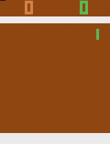
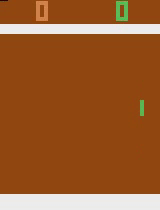
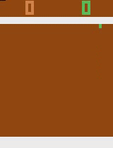
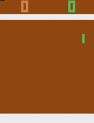
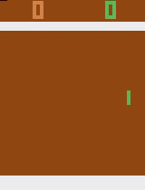
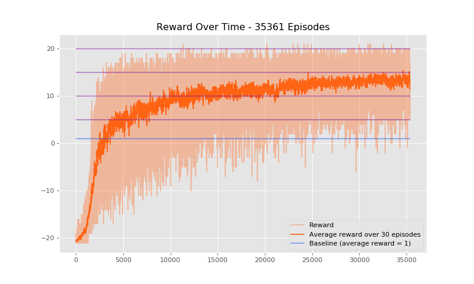

# Policy Gradient: Pong

The green pad is our actor, and it achieves an average reward over 30 episodes of 13.1.

||||||
|---|---|---|---|---|
||||||

## Settings
### Preprocessing
The frames (orignially of size 210 * 160) are converted to grayscale then directly resized to 80 * 80. The differential frame (current frame - previous frame) is flattened to a one-dimensional vector of length 6400 and fed into the actor network.
- Other tries
    - Cropped frame (removed scoreboard), subsampled frame with factor of 2, then computed the differential frame.

### Model Architecture
- Baseline Model
    - Fully connected (6400, 256), no bias
    - RelU
    - Fully connected (256, 256), no bias
    - ReLU
    - Fully connected (256, 1), no bias
    - Sigmoid

The dimension of the action space of the gym-Pong environment is 3 (up, down, doesn't move). We reduced the action space to 2 (up, down), hence using sigmoid at the output layer is sufficient.
### Other settings
- Optimizer: Adam, betas = (0.9, 0.999), learning rate = 0.0001.
- Gradient is accumulated every 10 episodes and then used to upadate the network to stabilize training process.
- Rewards are discounted with factor 0.99, and then normalized (substracted by their mean and then divided by their standard deviation).
### Results

The model is trained for 46 hours, achieving an average reward over 30 episodes of 13.1

